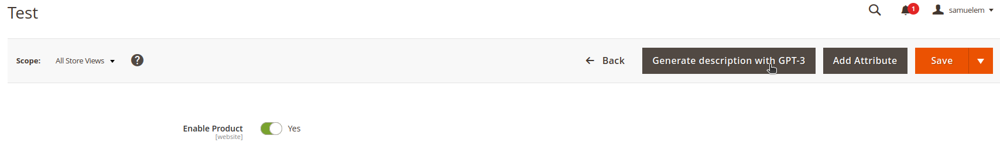
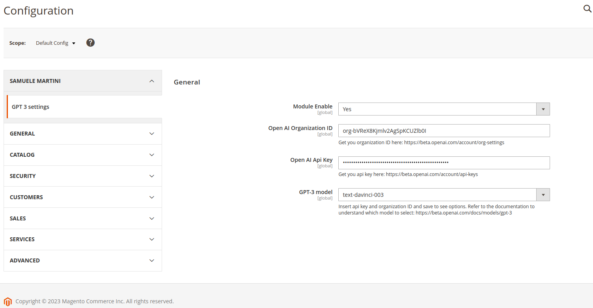

# SamueleMartini_GPT module

<font color='red'>**The following module integrates some OpenAI GPT model language features into Magento:** </font>

## Install
`composer require samuele-martini/module-openai-gpt`

## Admin panel usage
The main feature is the ability to automatically generate product and category descriptions from the admin panel.
Simply enter the modification page of a product or category and click on the appropriate button.
The description is generated via GPT model language starting from the product or category name, directly translated into the same language as the selected store view.
The generated description is only a preview, it needs to be revised and the product or category needs to be saved to consolidate it.



## Configurations
For the module working, you need to properly configure the parameters from the administration panel:

* Enable module: enable/disable the functions provided by the module
* Open AI Organization ID: your Open AI account ID, it can be found at this link after registering for a free account: https://beta.openai.com/account/org-settings
* Open AI Api Key: your Open AI auth api key, it can be found at this link after registering for a free account: https://beta.openai.com/account/api-keys
* OpenAI GPT model language: the natural language model that GPT should use to generate texts. The list will appear only after filling in the previous parameters and saving, as the list may be different for each account. To learn about the differences between the various models and choose the most suitable one, refer to the documentation: https://platform.openai.com/docs/models/overview

## For developers
Some notes of interest for developers

### Provided Magento Model
The module provides 3 Magento Models:
* Automatic language description generator for products
* Automatic language description generator for categories
* Automatic image generator

### Provided Service
The module provides 2 Service: 
* For products, using the respective Magento Model, this Service provides 3 methods:
  * Description generation based on arbitrary text and language
  * Description generation based on the sku and the store view, from these two parameters it obtains the product name and the language of the store view and generates a coherent text translated into the language
  * Description generation based on the product id and the store view, from these two parameters it obtains the product name and the language of the store view and generates a coherent text translated into the language
* For categories, using the respective Magento Model, this Service provides 2 methods:
  * Description generation based on arbitrary text and language
  * Description generation based on the category id and the store view, from these two parameters it obtains the category name and the language from the store view and generates a coherent text translated into the language

A Service has not been created for the images.
Due to the complexity and precision required in the instructions for generating consistent images, it is not possible to generate them starting from the simple product or category name.
You can use the Magento Model directly by providing precise instructions.

### Implementations and developments
Both the Magento Models and the Services provided by module are totally transparent with the other functionalities, therefore they are usable in third-party modules or developments via dependency injection, for other uses.

For example, the Services and the image Model can be used in the development of a systems integration, during the catalog import phase, to automatically generate images and starting descriptions in products and categories, if the master data in the ERP does not have them .

Another example: the provided Magento Models can be used to develop the automatic generation of texts also for CMS pages, or blog articles if a module is installed to manage it.

```
public function __construct(
        ...
        \SamueleMartini\GPT\Api\GenerateProductDescriptionInterface $generateProductDescription,
        ...
    ) {
        ...
        $this->generateProductDescription = $generateProductDescription;
        ...
    }

    ...
    ...
    ...
    $description = $this->generateProductDescription->getProductDescription($productName, $language);   
    $description = $this->generateProductDescription->getProductDescriptionBySku($sku, $storeId);
    $description = $this->generateProductDescription->getProductDescriptionById($productId, $storeId);
    ...
    ...
    ...
    $product->setDescription($description);
    $this->productRepository->save($product);
    ...
    ...
    ...
```

### Console Command
Some console commands have been made available, executable from the CLI.
They are only useful for testing the functions, the generated texts and images are not assigned to products and categories and do not determine their real modification.


-------------------------------------------------------------------------------------------------------------------------------------------


# SamueleMartini_GPT module

<font color='red'>**Il seguente modulo integra in Magento alcune funzionalità del modello linguistico GPT di OpenAI:** </font>

## Install
`composer require samuele-martini/module-openai-gpt`

## Utilizzo da pannello di amministrazione
La funzionalità principale è la possibilità di generare automaticamente la descrizione di prodotti e categorie dal pannello di amministrazione.
È sufficiente entrare nella pagina di modifica di un prodotto o di una categoria e cliccare nell'apposito pulsante.
La descrizione viene generata tramite il modello linguistico GPT a partire dal nome del prodotto o della categoria, direttamente tradotta nella stessa lingua della store view selezionata.
La descrizione generata è solo un'aneprima, deve essere revisionata ed il prodotto o la categoria devono essere salvati per consolidarla.


## Configurazioni
Affinché il modulo funzioni, occorre configurare opportunamente i parametri dal pannello di amministrazione:

* Enable module: serve per abilitare/disabilitare le funzionalità messe a disposizione dal modulo
* Open AI Organization ID: l'ID del tuo account Open AI, si trova a questo link dopo aver registrato gratuitamente un account: https://beta.openai.com/account/org-settings
* Open AI Api Key: l'api key per autenticare le richieste fatte dal modulo ad Open AI, si trova a questo link dopo aver registrato gratuitamente un account: https://beta.openai.com/account/api-keys
* OpenAI GPT model language: il modello di linguaggio naturale che GPT deve usare per generare i testi. La lista apparirà solo dopo aver compilato i precedenti parametri e salvato, in quanto per ogni account la lista potrebbe essere diversa. Per conoscere le differenze tra i vari modelli e scegliere quello più adatto, fare riferimento alla documentazione: https://platform.openai.com/docs/models/overview

## Per gli sviluppatori
Alcune note di interesse per gli sviluppatori

### Magento Model messi a disposizione
Il modulo mette a disposizione 3 Magento Model:
* Generatore automatico descrizione in lingua per i prodotti
* Generatore automatico descrizione in lingua per le categorie
* Generatore automatico di immagini

### Service messi a disposizione
Il modulo mette a disposizione 2 Service:
* Prodotti, questo service utilizzando il rispettivo Magento Model, mette a disposizione 3 metodi:
    * Generazione descrizione basandosi su testo e lingua arbitrari
    * Generazione descrizione in base allo sku e alla store view, da questi due parametri ricava il nome del prodotto e la lingua della store view e genera un testo coerente tradotto in lingua
    * Generazione descrizione in base all'id prodotto e alla store view, da questi due parametri ricava il nome del prodotto e la lingua della store view e genera un testo coerente tradotto in lingua
* Categorie, questo service utilizzando il rispettivo Magento Model, mette a disposizione 2 metodi:
    * Generazione descrizione basandosi su testo e lingua arbitrari
    * Generazione descrizione in base all'id categoria e alla store view, da questi due parametri ricava il nome della categoria e la lingua dalla store view e genera un testo coerente tradotto in lingua

Per le immagini non è stato creato un service.
A causa della complessità e della precisione necessarie nelle istruzioni per la generazione di immagini coerenti, non è possibile generarle partendo dal semplice nome del prodotto o della categoria.
Si può utilizzare direttamente il Magento Model fornendo delle istruzioni precise.

### Implementazioni e sviluppi
Sia i Magento Model che i Service messi a disposizione sono totalmente trasparenti rispetto alle altre funzionalità, quindi utilizzabili in moduli o sviluppi terzi tramite dependency injection, per altri utilizzi.

Ad esempio i Service ed il Magento Model delle immagini sono utilizzabili nello sviluppo di un'integrazione sistemi, durante la fase di importazione del catalogo, per generare automaticamente immagini e descrizioni di partenza in prodotti e categorie, qualora le anagrafiche nell'ERP ne siano sprovviste.

Un altro esempio: i Magento Model messi a disposizione possono essere usati per sviluppare la generazione automatica dei testi anche per le CMS page, o gli articoli del blog se installato un modulo per gestirlo.

```
public function __construct(
        ...
        \SamueleMartini\GPT\Api\GenerateProductDescriptionInterface $generateProductDescription,
        ...
    ) {
        ...
        $this->generateProductDescription = $generateProductDescription;
        ...
    }

    ...
    ...
    ...
    $description = $this->generateProductDescription->getProductDescription($productName, $language);   
    $description = $this->generateProductDescription->getProductDescriptionBySku($sku, $storeId);
    $description = $this->generateProductDescription->getProductDescriptionById($productId, $storeId);
    ...
    ...
    ...
    $product->setDescription($description);
    $this->productRepository->save($product);
    ...
    ...
    ...
```

### Console Command
Sono stati messi a disposizione alcuni console command, eseguibili da CLI.
Questi servono solo per testare le funzionalità, i testi e le immagini generati non vengono assegnati a prodotti e categorie e non ne determinano la modifica reale.
